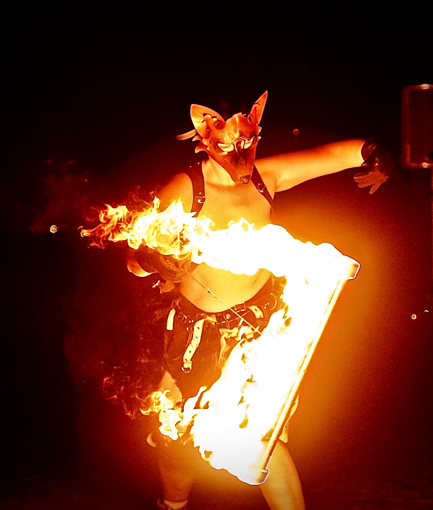

## FireFox
FireFox (they/them) is a flow arts performer hailing from the States moved to Australia in pursuit of a dream. In 2015 they attended their first fire show and were mesmerized by levitation wand and dragonstaff, their now main props. Flow arts have become more than just a hobby and they have devoted time, energy, and money into running weekly fire jams, giving safety trainings, putting on shows, and teaching workshops. Workshops include poi, contact staff, traditional staff, rope dart, levitation wand, dragonstaff, palm torches, movement with flow, partner choreography, fire play/fleshing, and devil sticks. They have taught at festivals, universities, markets, and privately. Over the last 10 years, fire has been a defining part of their life, as has the burning desire to share such a hot hobby. 

## Fire

Fire burns bright as a deep passion. Below are a couple of performances with various props.

### Full Fire Leviwand

Photo by Josh, taken at FireFly Arts Retreat

### Palm Torches

Photo by @mwcrane13, taken at Granite Festival

### DragonStaff

Photo by Gabriel, taken at Granite Festival
