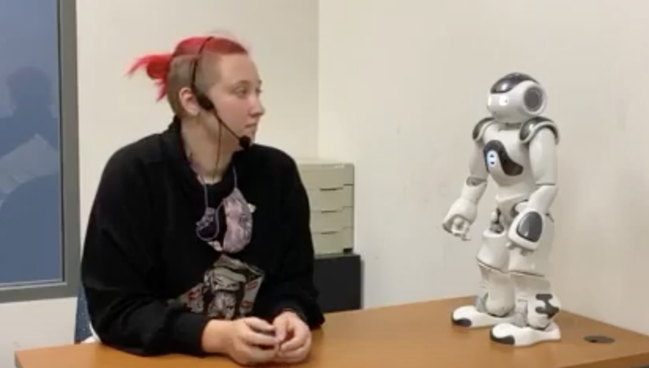
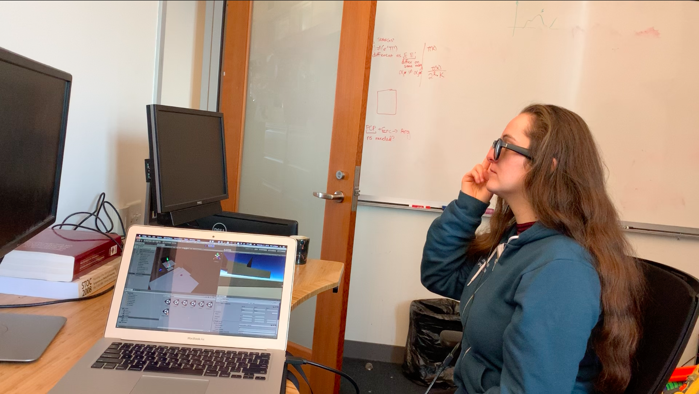
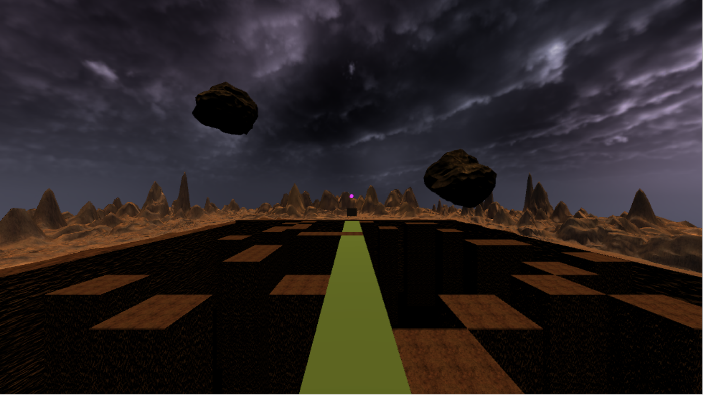
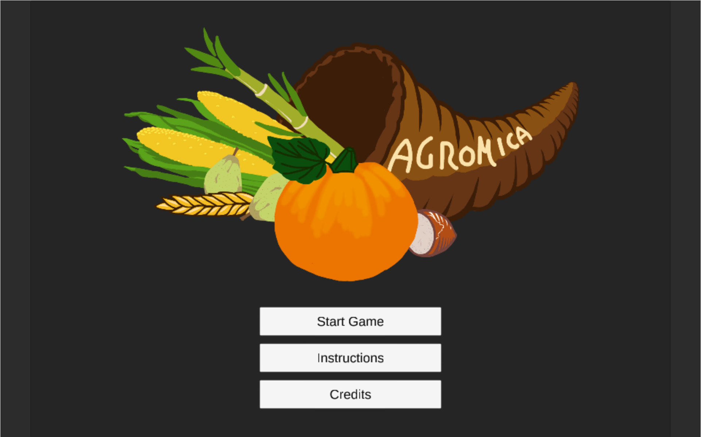
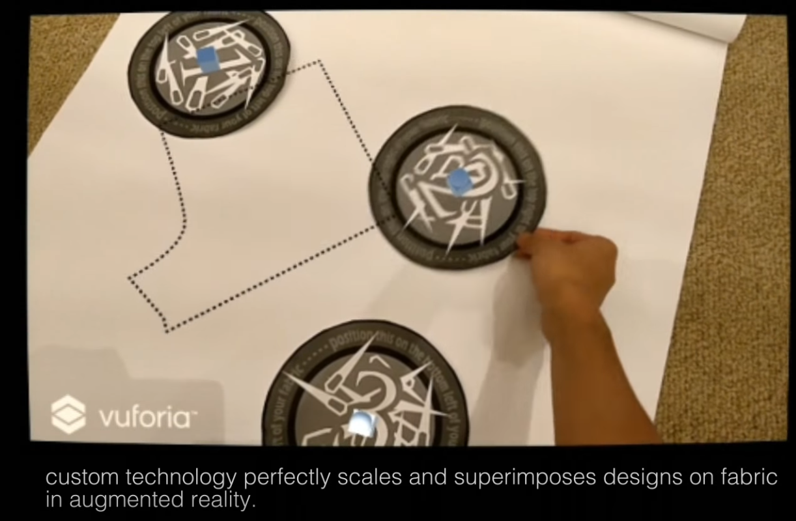

## Gwendolyn Edgar

Gwen is currently pursuing a PhD in marine robotics for conservation at the Queensland University of Technology (QUT). In 2022 they completeed a reserach focused Masters at Tufts University, working on Human Robot Interaction. Their research focused on collaborative robotics, aiming to make robots teammates not tools and led to working on underwater HRI now. They graduated from MIT in 2019 with a Bachelors of Science in Electrical Engineering and Computer Science with a minor in Comparative Media Studies. 

Gwen is interested in human-computer/machine interactions especially with the use of XR. They have worked on systems utilizing interactions between humans and machines to deliver a novel experiance in Tokyo and at MIT in visual augmented reality, audio augmented reality, virtual reality, and haptic systems. 

## Projects

### Teammates, not Tools: Developing Proactive Robotic Teammates using Shared Mental Models

In this demo, I am being prompted by Nao, the small robot, if I wish for it to do a task. This natrual language processing component implemetation was a step foward in my work on proactive, collaborative teammates. The entire demo was done through a cognitive architecture, DIARC. I am developing robots that understand human goals and contribute towards their completion by both proactively aiding humans and effectively dispersing the workload among fellow robots using shared mental models. For this project, I am developing an autonomy software and running a user study to determine the optimal level of proactiveness and use of shared mental models.  

[Demo](https://youtu.be/-1uy76qiRNc)

### Audio Only Augmented Reality Platformer Game with BoseAR

In this project, we explored a new kind of game: a “blind platformer.” Using the spatial sound capabilities of Unity in conjunction with Bose Frames, we designed a game where the player uses their ears to navigate. Our first goal was to determine if this was even possible. Then, once we had that, we wanted to make the experience fun, and not frustrating. To that end, we found three guidelines to follow when designing a game meant to be played and navigated with audio only:
(i) offer the player one audio target at a time, (ii) always have a linear path to follow, and (iii) give clear and immediate feedback. 
This project was built by me and another person, and we were both involved in all aspects of designing and implementation.

[Youtube](https://www.youtube.com/watch?v=XnTTtl0vi3g)

### Avatar VR

  Inspired by the popular show Avatar, as part of my class CMS.339, my team developped a virtual reality game. In the game, you solve puzzles using different bending techniques, like the show (e.g. fire bending). My main role in the project was the interface the user experianced. How did they interact in the world? How could we make the experiance feel natural? How could we make each motion unique and capture the essence of different elements - flow for water, force for fire, rotation for air, and lines for earth. While I helped design the puzzles, the majority of my time was focused on getting manipulations from the oculus controllers and finding what data we needed to look for to read each interaction. 
   

   
 [Youtube](https://www.youtube.com/watch?v=A2SIj2BIOAo)
 
 [Github](https://github.com/jimmyz42/avatar-puzzles)

### Agromica Farming and Finance Video Game

  As part of my CMS.611, my team developed a farm game, where you pland, harvest and leverage the local market to expand your farm. We all spent a lot of time designing the game at the start of the project. I primarily worked on the backend when developping this game, focusing on modularity. 
    

    
 [Play!](https://darbopp.github.io/)
 
 [Github](https://github.com/Mach131/CMS611-S19Final)

### MIT AR/VR Hackathon Best AR Award, Fall 2017

 We've been making clothing the same way since 1860 using inflexible tissue paper designs. Our application scales and superimposes clothing patterns on fabric, greately simplifying making clothes.
 

 
 [Youtube](https://www.youtube.com/watch?v=9dUAmJhmx0w) 
 
 [Github](https://github.com/Reality-Virtually-Hackathon/CosplayAR)

