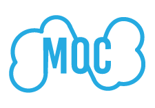

## Gwendolyn Edgar

Gwen is a software engineer for biotech startup Nirrin Analytics. They graduated from MIT in 2019 with a Bachelors of Science in Electrical Engineering and Computer Science with a minor in Comparative Media Studies. 

Gwen is interested in human-computer/machine interactions especially with the use of XR. They have worked on systems utilizing interactions between humans and machines to deliver a novel experiance in Tokyo and at MIT in visual augmented reality, audio augmented reality, virtual reality, and haptic systems. 

## Experience

### Nirrin Analytics, Spring 2019 - Now  

 I work at a startup called Nirrin Analytics striving to improve research and production of protein based drugs through real time analytics of bioreactor contents using NIR lasers and advanced modeling.  I design, implement, review, and debug software solutions and modeling.  In this past year, I have independently developed and currently maintain a significant portion of our codebase. Since Nirrin is a small company, I have worked on security, networks, databases, APIs and overall infrastructure. It has been a very rewarding experience to learn and build on multiple aspects of a product. 
 

[Website](https://nirrin.tech/)

### Fritz AI, Winter 2018 - Fall 2018

I worked as a full stack engineer with a Boston based startup, Fritz AI, that was creating a platform to run machine learning algorithms locally on a mobile device as well as a system to evaluate the developer’s learning models. During my time at Fritz, I implemented multiple features and helped with the company's launch. 
 

 
 [Website](https://www.fritz.ai/)

### MIT Game Lab UROP, Spring 2018 

In my junior year, I joined the MIT Game Lab, where I worked on CLEVR, Collaborative Learning Environment in Virtual Reality, headed by Philip Tan and funded by a grant from the Oculus Story Studio. CLEVR was a mostly student designed educational game promoting cell understanding in highschool biology through "in person" discovery and collaboration between two students - one in virtual reality and one on a companion device. In this project, I participated in the design discussions, built parts and user tested the game, building upon input in further iterations. This was a very rewarding experience for me as I developed both technical and collaboration skills.
 

 
 [Website](https://education.mit.edu/project/clevr/)
 
 [Youtube](https://www.youtube.com/watch?v=LQFQl3aVijs)
 

### H2L, Summer 2017 

 In my sophomore year, I reached out to a startup company in Japan working to 'touch' the virtual world - H2L. My application was accepted and that summer I moved to Japan to work with them. At H2L,  I worked under Dr. Emi Tamaki, an associate professor at Waseda University to spearhead an inhouse project centered around sharing experiences between a human and a robot (Nao) using their haptic sensor and feedback system (Unlimited Hand) and augmented reality (Microsoft Hololens). I designed and built a system enabling a human to control and receive input from Nao in a natural way. My system understood how the human moved their head and what gestures they performed. It then piped this information to Nao, whose head and arms moved in a similar way as the human’s.  At the same time, the human could see through Nao’s eyes,  receiving live feedback through a video feed projected on the Hololens. My proof of concept was a success and Professor Tamaki advanced work on this project after I left with different robotic systems.
  

  
  [Website](http://unlimitedhand.com/en/)

### Opencloud MOC team at Boston University, Winter 2016

 I was part of a dynamic team contributing involving in Enhancing OpenStack to enable multiple providers to participate in a shared cloud.
  

  
  [Website](https://massopen.cloud/)
  
### Rainbow Lounge Student Worker, Fall 2015 - Spring 2018

LBGTQ+ issues are very important to me. For most of my MIT career, I worked at the Raibow lounge helping create a more inclusive and welcoming envoronment at MIT. 
  

[Website](https://lbgtq.mit.edu/home)

