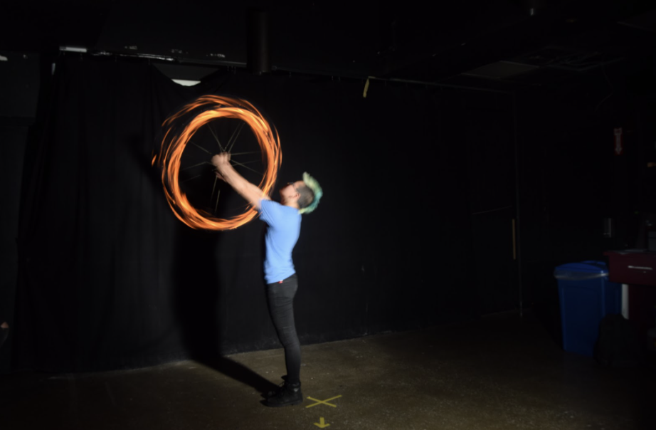
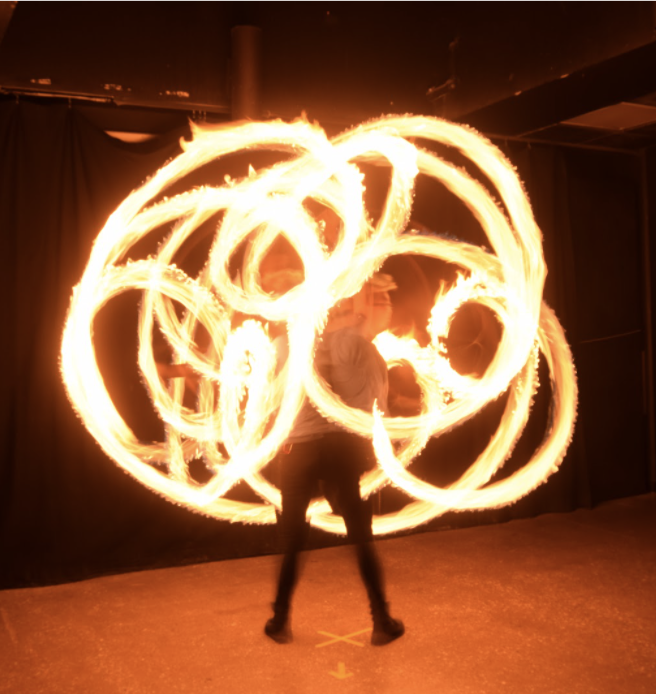
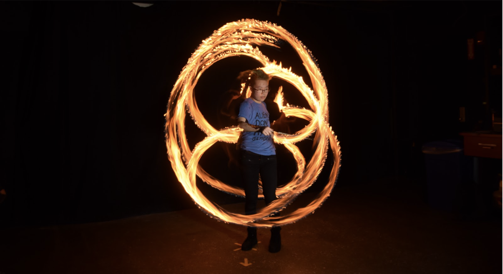
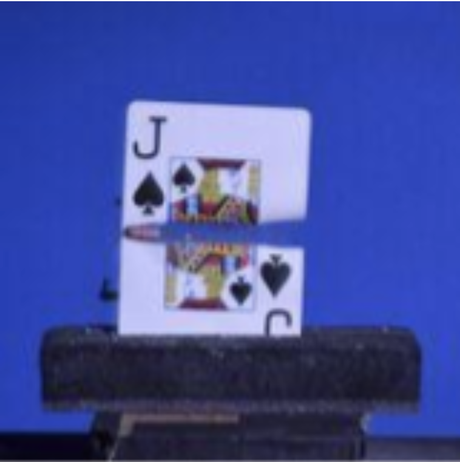
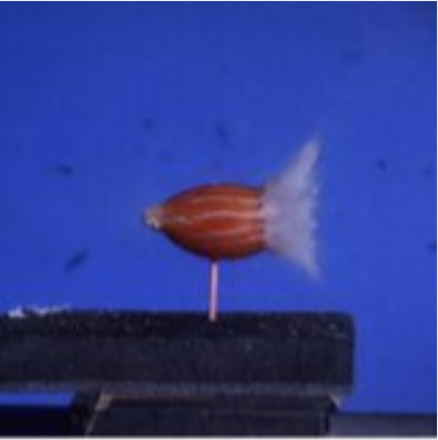
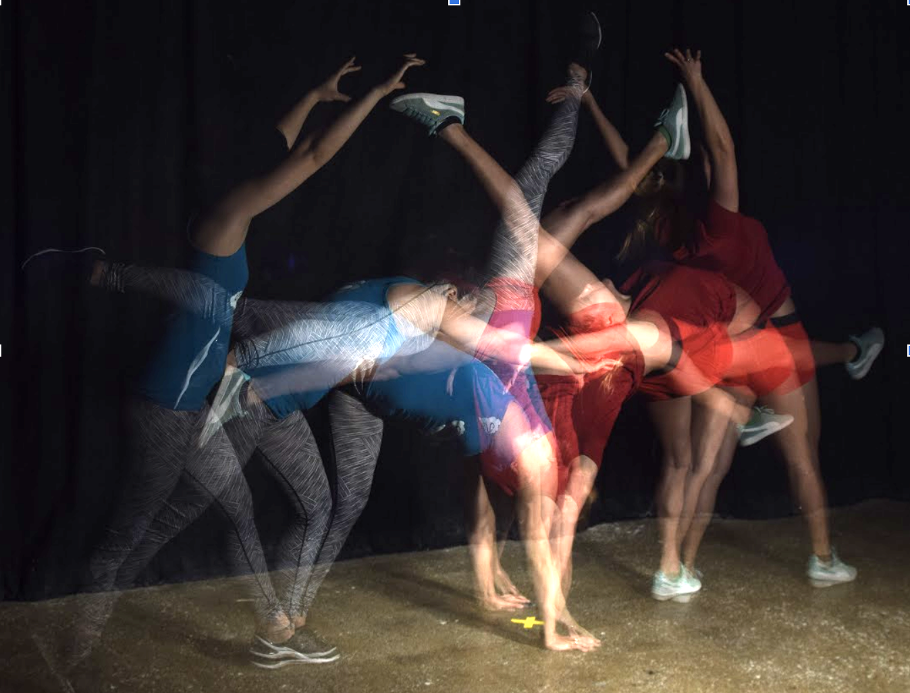

## Gwendolyn Edgar

Gwen is a software engineer for biotech startup Nirrin Analytics. They graduated from MIT in 2019 with a Bachelors of Science in Electrical Engineering and Computer Science with a minor in Comparative Media Studies. 

Gwen is interested in human-computer/machine interactions especially with the use of XR. They have worked on systems utilizing interactions between humans and machines to deliver a novel experiance in Tokyo and at MIT in visual augmented reality, audio augmented reality, virtual reality, and haptic systems. 

## Photography

I took a strobe photography class while at MIT, and discovered a new passion. 

### Fire 

### Bullets 

### Gymnastics 

