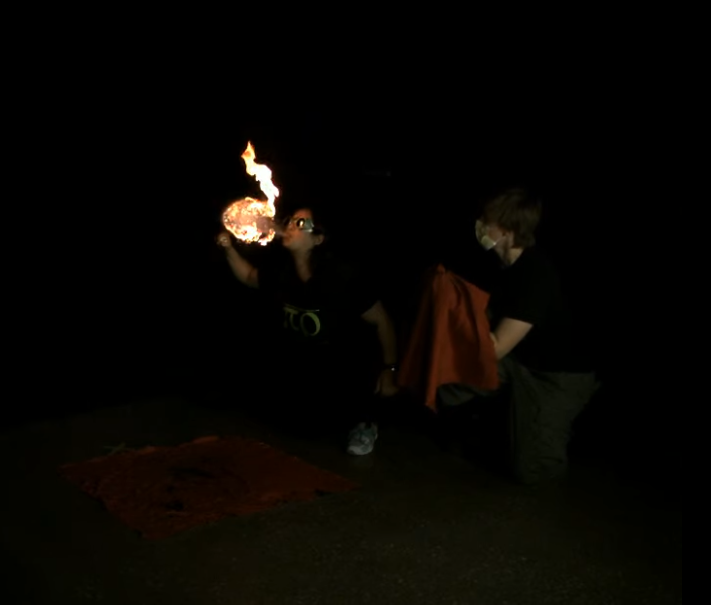

## Gwendolyn Edgar
Gwen is currently pursuing a PhD in marine robotics for conservation at the Queensland University of Technology (QUT). In 2022 they completeed a reserach focused Masters at Tufts University, working on Human Robot Interaction. Their research focused on collaborative robotics, aiming to make robots teammates not tools and led to working on underwater HRI now. They graduated from MIT in 2019 with a Bachelors of Science in Electrical Engineering and Computer Science with a minor in Comparative Media Studies.

Gwen is interested in human-computer/machine interactions especially with the use of XR. They have worked on systems utilizing interactions between humans and machines to deliver a novel experiance in Tokyo and at MIT in visual augmented reality, audio augmented reality, virtual reality, and haptic systems.

## Photography

I took a strobe photography class while at MIT, and discovered a new passion. 

### Fire Breathing

[Youtube](https://www.youtube.com/watch?v=qsXwwbKIZbg)

### Fire Spinning

### Bullets 

### Gymnastics 

