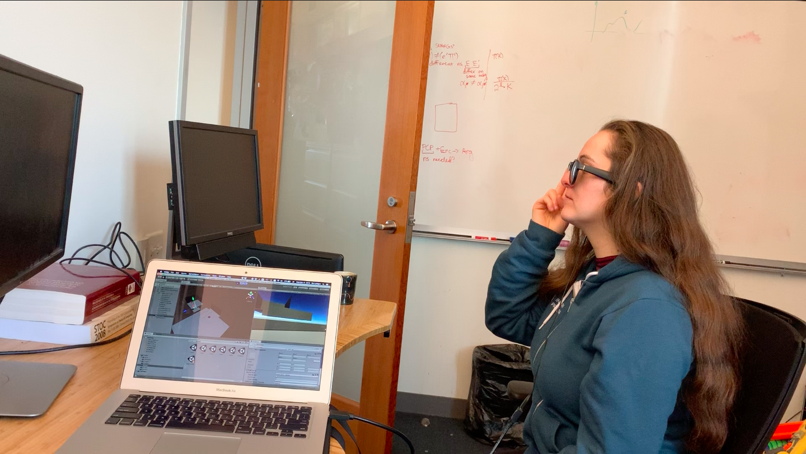

## Gwendolyn Edgar

Gwen is a software engineer for biotech startup Nirrin Analytics. They graduated from MIT in 2019 with a Bachelors of Science in Electrical Engineering and Computer Science with a minor in Comparative Media Studies. 

Gwen is interested in human-computer/machine interactions especially with the use of XR. They have worked on systems utilizing interactions between humans and machines to deliver a novel experiance in Tokyo and at MIT in visual augmented reality, audio augmented reality, virtual reality, and haptic systems. 

## Projects

### Going-in-Blind: Audio Only Augmented Reality Platformer Game with BoseAR

In this project, we explored a new kind of game: a “blind platformer.” Using the spatial sound capabilities of Unity in conjunction with Bose Frames, we designed a game where the player uses their ears to navigate. Our first goal was to determine if this was even possible. Then, once we had that, we wanted to make the experience fun, and not frustrating. To that end, we found three guidelines to follow when designing a game meant to be played and navigated with audio only:
(i) offer the player one audio target at a time, (ii) always have a linear path to follow, and (iii) give clear and immediate feedback. 
This project was built by me and another person, and we were both involved in all aspects of designing and implementation.

[Youtube](https://www.youtube.com/watch?v=XnTTtl0vi3g)

### ChakraScape - Avatar VR

  Inspired by the popular show Avatar, as part of my class CMS.339, my team developped a virtual reality game. In the game, you solve puzzles using different bending techniques, like the show (e.g. fire bending). My main role in the project was the interface the user experianced. How did they interact in the world? How could we make the experiance feel natural? How could we make each motion unique and capture the essence of different elements - flow for water, force for fire, rotation for air, and lines for earth. While I helped design the puzzles, the majority of my time was focused on getting manipulations from the oculus controllers and finding what data we needed to look for to read each interaction. 
   

   
 [Youtube](https://www.youtube.com/watch?v=A2SIj2BIOAo)
 
 [Github](https://github.com/jimmyz42/avatar-puzzles)

### Napal Learning Through Games Initiative, Agromica

In one of my classes at MIT, I worked in a team to build a market understanding game designed for use in classrooms as supplemental material for middle school students. My team developed a farm game, where players grow and harvest crops to meet successive quotas. They can also buy and sell crops on an in-game marketplace and borrow money from a bank. Interacting with the marketplace and bank is required to complete some levels. We all spent a lot of time designing the game at the start of the project based on middle school finance and economics lessons from Nepal. I primarily worked on the backend when developing this game, focusing on the general framework, modular pieces and expansion of the game. After the class ended, we gave our work to MIT-Nepal to be further developed and released as an educational game in classrooms. 
    

    
 [Play!](https://darbopp.github.io/)
 
 [Github](https://github.com/Mach131/CMS611-S19Final)

### MIT AR/VR Hackathon Best AR Award, Fall 2017

 Humans have been making clothing the same way since 1860 using inflexible tissue paper designs. These designs assume a dedicated space that will not be disturbed by animals or other people. Our application scales and superimposes clothing patterns on fabric given user input, greately simplifying making clothes and creating a much smoother experiance. Through this app, we hope to decrease the barrier of creating clothes at home. 
 

 
 [Youtube](https://www.youtube.com/watch?v=9dUAmJhmx0w) 
 
 [Github](https://github.com/Reality-Virtually-Hackathon/CosplayAR)

