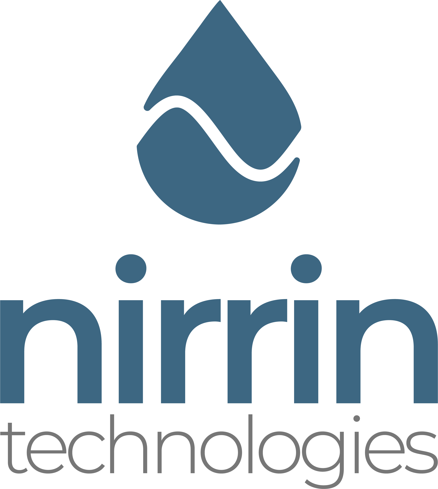
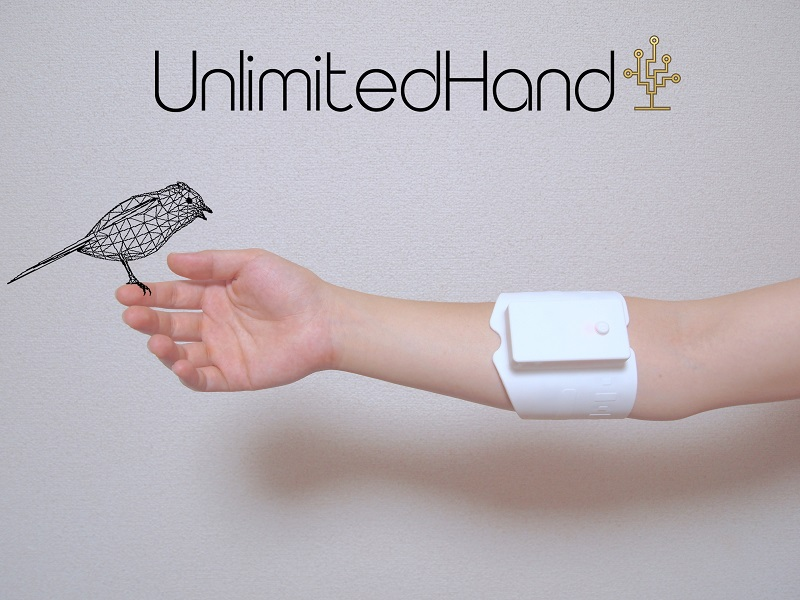
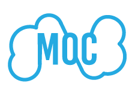
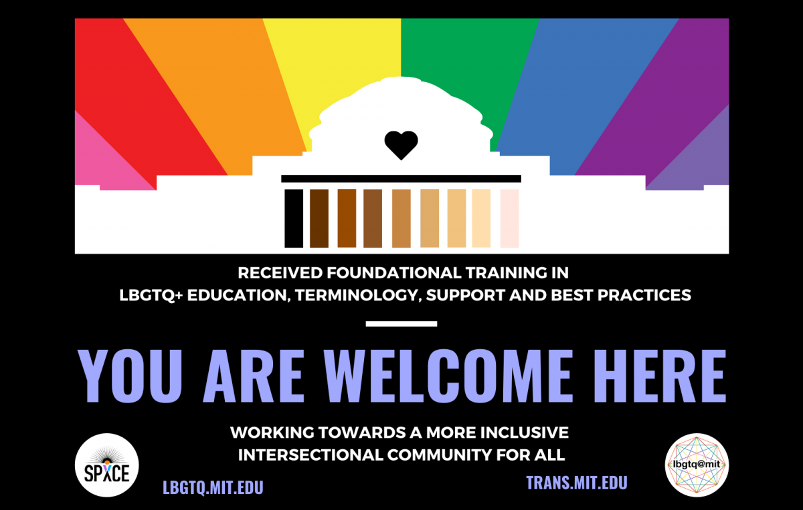

## Gwendolyn Edgar

Gwen is currently pursuing a PhD in marine robotics for conservation at the Queensland University of Technology (QUT). In 2022 they completeed a reserach focused Masters at Tufts University, working on Human Robot Interaction. Their research focused on collaborative robotics, aiming to make robots teammates not tools and led to working on underwater HRI now. They graduated from MIT in 2019 with a Bachelors of Science in Electrical Engineering and Computer Science with a minor in Comparative Media Studies.

Gwen is interested in human-computer/machine interactions especially with the use of XR. They have worked on systems utilizing interactions between humans and machines to deliver a novel experiance in Tokyo and at MIT in visual augmented reality, audio augmented reality, virtual reality, and haptic systems.

## Experience

### [Nirrin Analytics, 2019 - 2021](#nirrin)  

 I work at a startup called Nirrin Analytics striving to improve research and production of protein based drugs through real time analytics of bioreactor contents using NIR lasers and advanced modeling.  I design, implement, review, and debug software solutions and modeling.  In this past year, I have independently developed and currently maintain a significant portion of our codebase. Since Nirrin is a small company, I have worked on security, networks, databases, APIs and overall infrastructure. It has been a very rewarding experience to learn and build on multiple aspects of a product. 
 
Some of the work I do:
 <ul>
<li>    Designed and Built a network architecture with OpenOPC</li>
<li>    Started and run team sprints and keep track of progress of team members</li>
<li>    Reworked the system to send patches to test devices with partners and implemented security features therein</li>
<li>    Uploading data securely, changing data format for easier consumption, and allowing for outside data to be added to the system</li>
<li>    Redesigned the routing system for modularity and clarity</li>
<li>    Designed, built, and maintain a restful API</li>
<li>    Upgraded system to run production server and moved storage and operations to external storage</li>
<li>    Reworking database for clarity and better storage</li>
<li>    Improving data modeling and modularity</li>
<li>    Detect and eliminate slowdowns in the codebase</li>
<li>    Debug for database, API, GUI, networking, modeling, and any other software issues</li>
<li>    Write documentation</li>
 </ul>

[Company Website](https://nirrin.tech/)

### [Fritz AI, Winter 2018 - Fall 2018](#fritz)

I worked as a full stack engineer with a Boston based startup, Fritz AI, that was creating a platform to run machine learning algorithms locally on a mobile device as well as a system to evaluate the developer’s learning models. The point of this was to protect personal data or to allow for machine learning to help people who do not have consistent data connection. The use cases of these two are as follows: some data is too sensitive or personal to be trusted to go online or be collected such as in the case of a STD detector; there are many places where phones are prevalient but data connections are not. A prime example of this use case is a project we helped with where farmers in third world countries would download the models while in town then use their phones to detect crop disease and learn how to treat it. During my time at Fritz, I implemented multiple features and helped with the company's public launch. This work was the exact opposite of my previous internship as I was fully part of the software team. I filled tickets and participated in code review. 
 

 
 [Company Website](https://www.fritz.ai/)

### [MIT Game Lab UROP, Spring 2018](#clevr) 

In my junior year, I joined the MIT Game Lab, where I worked on CLEVR, Collaborative Learning Environment in Virtual Reality, headed by Philip Tan and funded by a grant from the Oculus Story Studio. CLEVR was a mostly student designed educational game promoting cell understanding in highschool biology through "in person" discovery and collaboration between two students - one in virtual reality and one on a companion device. In this project, I participated in the design discussions, built parts and user tested the game, building upon input in further iterations. This was a very rewarding experience for me as I developed both technical and collaboration skills.
 

 
 [Website](https://education.mit.edu/project/clevr/)
 
 [Youtube](https://www.youtube.com/watch?v=LQFQl3aVijs)
 

### [H2L, Summer 2017](#h2l) 

 In my sophomore year, I reached out to a startup company in Japan working to 'touch' the virtual world - H2L. My application was accepted and that summer I moved to Japan to work with them. At H2L,  I worked under Dr. Emi Tamaki, an associate professor at Waseda University to spearhead an inhouse project centered around sharing experiences between a human and a robot (Nao) using their haptic sensor and feedback system (Unlimited Hand) and augmented reality (Microsoft Hololens). I designed and built a system enabling a human to control and receive input from Nao in a natural way. My system understood how the human moved their head and what gestures they performed. It then piped this information to Nao, whose head and arms moved in a similar way as the human’s.  At the same time, the human could see through Nao’s eyes,  receiving live feedback through a video feed projected on the Hololens. My proof of concept was a success and Professor Tamaki advanced work on this project after I left with different robotic systems.
  

  
  [Company Website](http://unlimitedhand.com/en/)

### [Opencloud MOC team at Boston University, Winter 2016](#moc)

I was in a dynamic team contributing to Enhancing OpenStack to enable multiple providers to participate in a shared cloud. Massachussetts Open Cloud(MOC) aimed to create a self-sustaining at-scale public cloud based on the Open Cloud eXchange model. It is currently fully operational. I was specifically working with the Hardware Isolation Layer (HIL) group at Boston University which allocates and configures nodes (typically computers or users) and networks. I worked primarily with fellow MIT student Mengyuan Sun to implement outward facing features that interfaced with the rest of the team.
  

  
  [Group Website](https://massopen.cloud/)
  
  [Presentation](https://www.redhat.com/files/summit/session-assets/2017/S108148-rhsummit-moc-rh-talk-2017-v06.pdf)
  
### [Rainbow Lounge Student Worker, Fall 2015 - Spring 2018](#gay)

LBGTQ+ issues are very important to me. For most of my MIT career, I worked at the Rainbow Lounge helping to create a more inclusive and welcoming envoronment at MIT. My duties there included providing a welcoming environment for students who needed a safe space or someone to talk to without judgement. I was also tasked with running events, compiling the newsletter, finding funding, and furthering outreach to more students. I enjoyed this work a lot on a more emotional level - you can see people grow and become more comfortable with themselves and maybe be a part of that. I stopped my work my senior year due to time constraints. 
  

[Website](https://lbgtq.mit.edu/home)

